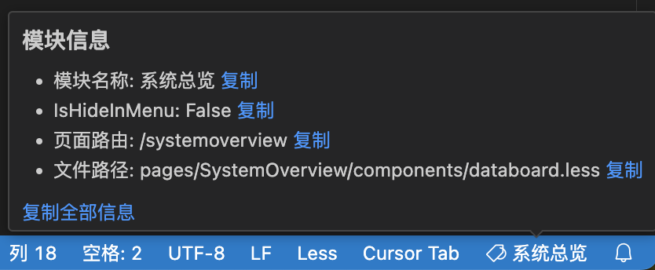

### version 0.1.3

### 功能

- 查看当前文件的模块名称
- 单文件右键点击 `重新分析模块映射` 重新分析当前文件的模块名称
- 支持热模块更新配置信息（routes更新、pages更新）
- 相对路由级别目录能做到精准映射识别（可信
- 相对路由下的组件目前只能做到模糊标识（tags信息相对根路由显示，除了文件路径可信外，其余信息存在一定模糊

### 配置字段

- `extensionmodulemap.moduleSourceMapPath`: 需要解析的模块路径，默认值为`./src/pages`
- `extensionmodulemap.routeConfigPath`: 需要解析的路由文件，默认值为`./config/routes.ts`

### 效果

